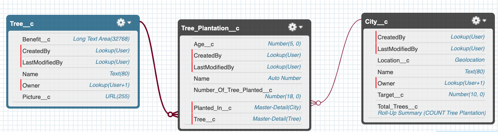

# Tree-Plantation

### This is a sample application for my course [A Practical Guide for SFDX and Salesforce CLI](https://www.udemy.com/course/salesforce-cli/?referralCode=91D0F7061562D1B59737)

**Enroll for full course on Udemy: [here](https://www.udemy.com/course/salesforce-cli/?couponCode=FEBDEAL)**

**Watch free videos on Salesforce CLI and SFDX on [Youtube](https://www.youtube.com/playlist?list=PLQXsHnNZgiNd_oe-gDSeESyguQqfEPdRw):** 

### Application Schema

### How to deploy the code using Salesforce CLI
1. Download the code of this repo
2. Navigate to the project folder in your operating system, and open terminal/cmd in that folder
3. From the root folder of the project
    1. Authorize a Salesforce org `sfdx force:auth:web:login --setalias sfdxcourseorg --instanceurl https://login.salesforce.com --setdefaultusername`
    2. Deploy the code `sfdx force:source:deploy -p force-app/main/default`
    3. Assign permission set `sfdx force:user:permset:assign -n TreePlantation`
    4. Open your Salesforce org `sfdx force:org:open` and explore the project

